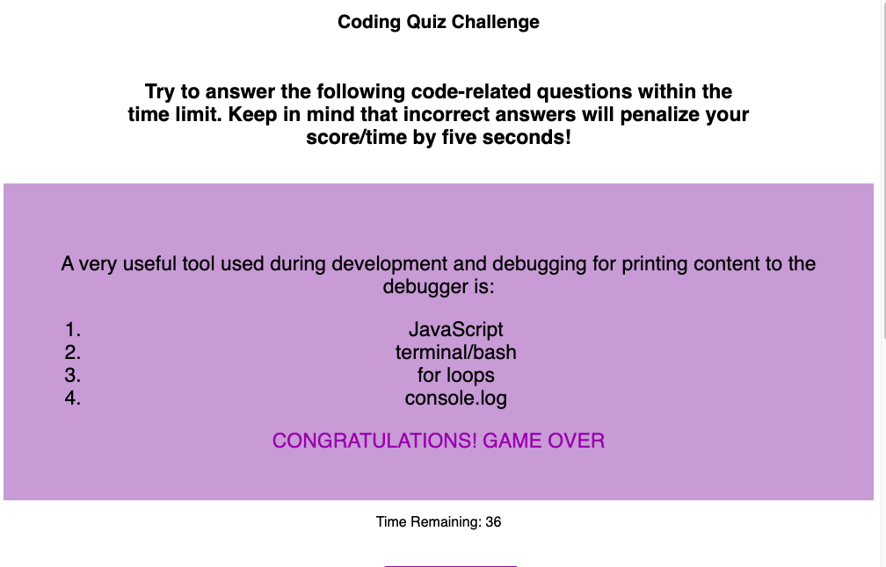
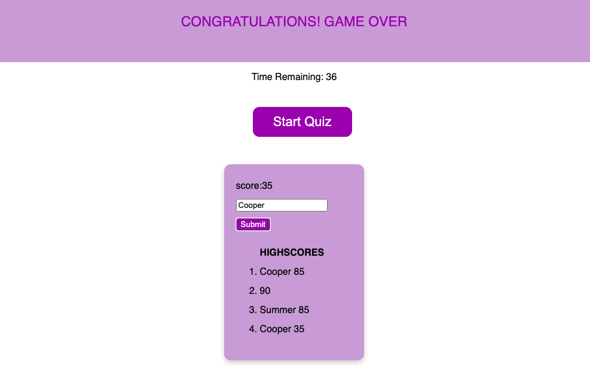

# unit-4-homework

Web-APIs

Coding Quiz

Unit 4 homework was to build and online quiz by manipulating the DOM. The user answers a series of multiple choice questions. If a wrong answer is given time is deducted from the amount of time remaining. At the end of the quiz the user’s final time (score) and initials are logged. Participants are ranked according to their score. No starter code was given. I had to build the html, css and js files. This project utilized and increased my knowledge of:
event listeners,
timers/intervals and interval clears,
text content,
local storage, and
query selectors.

https://michelleberta.github.io/coding-quiz-challenge/

